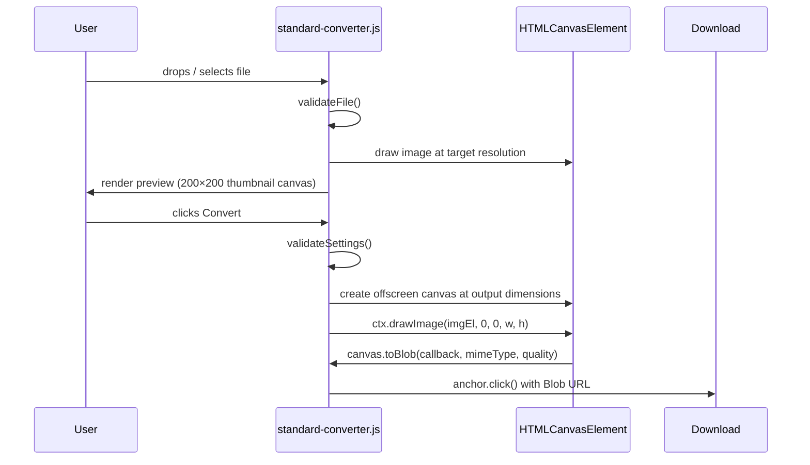
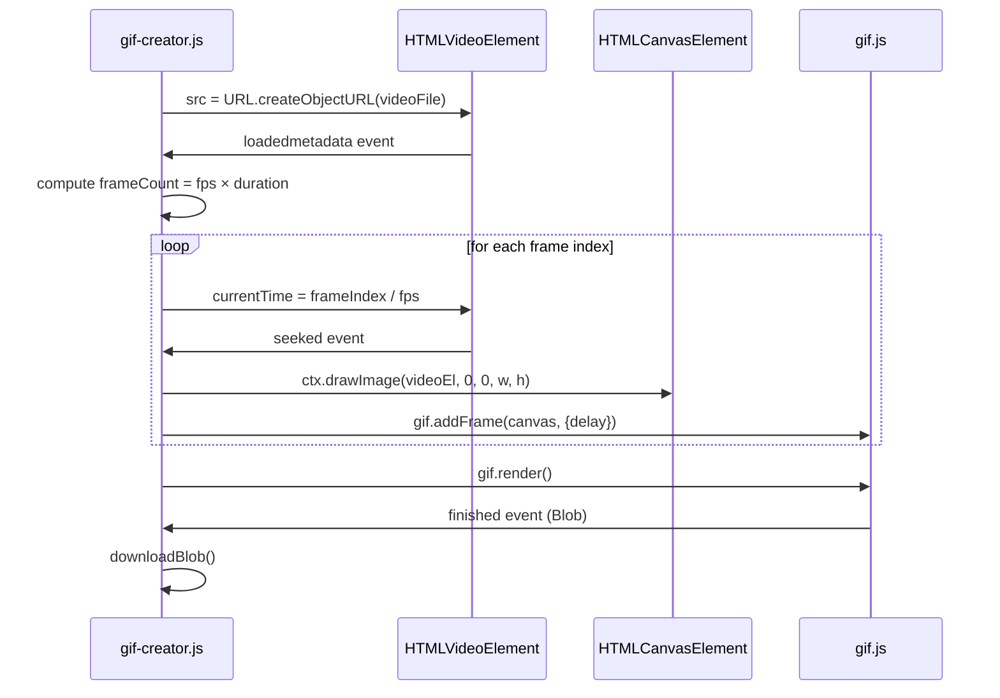
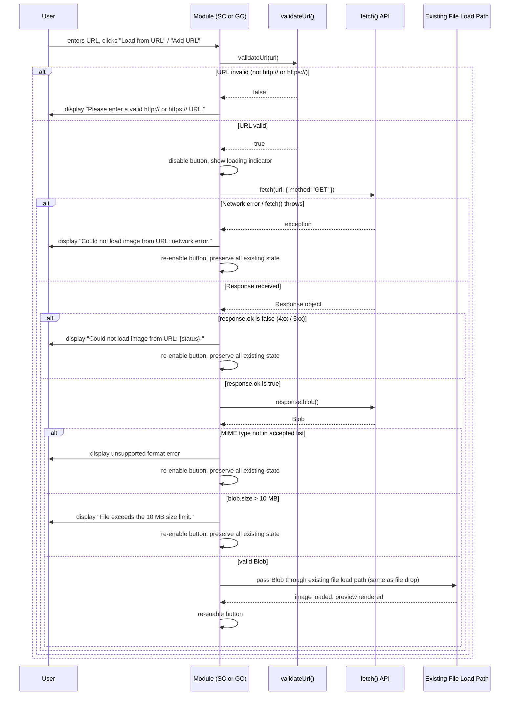
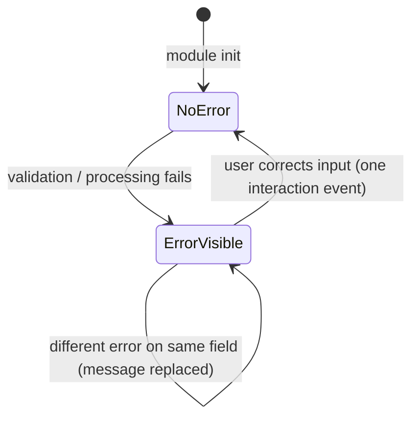

# Design Document: Image Type Converter Extension

## Overview

The Image Type Converter Extension is a Chrome Manifest V3 browser extension that performs fully client-side image format conversion and animated GIF creation. All processing runs in the browser using the Canvas API and a bundled copy of gif.js — no image or video data ever leaves the user's device.

The popup UI contains a sticky two-tab bar. Tab 1 (Standard Converter) accepts a single static image and converts it to a chosen output format with optional resolution scaling. Tab 2 (Advanced GIF Creator) accepts sequential frame images or a short MP4/WEBM video clip and encodes them into a downloadable animated GIF. Both modules support loading images directly from publicly accessible HTTP/HTTPS URLs as an alternative to file uploads, using the browser's `fetch()` API with all validation applied identically to file-based input.

The extension is structured as three JavaScript modules:
- `popup.js` — entry point, mounts the tab bar, imports and initialises both feature modules
- `standard-converter.js` — all Standard Converter UI and conversion logic
- `gif-creator.js` — all GIF Creator UI and encoding logic

---

## Architecture

### High-Level Component Diagram

```mermaid
graph TD
    subgraph Chrome Extension Package
        MF[manifest.json<br/>MV3, popup action]
        PH[popup.html]
        PJ[popup.js<br/>Entry Point]
        SC[standard-converter.js<br/>Standard Converter Module]
        GC[gif-creator.js<br/>GIF Creator Module]
        GIFLIB[gif.js + gif.worker.js<br/>Bundled GIF Library]
        STYLES[popup.css]
    end

    PH --> PJ
    PJ --> SC
    PJ --> GC
    GC --> GIFLIB
    PH --> STYLES

    subgraph Browser APIs
        CA[Canvas API<br/>HTMLCanvasElement]
        VID[HTMLVideoElement<br/>Frame Extraction]
        DL[chrome.downloads / <br/>anchor.click download]
        FR[FileReader API]
        FT[fetch() API<br/>URL Image Loading]
    end

    SC --> CA
    SC --> FR
    SC --> DL
    SC --> FT
    GC --> CA
    GC --> VID
    GC --> FR
    GC --> DL
    GC --> FT
```

### Module Responsibility Summary

| Module | Responsibility |
|---|---|
| `manifest.json` | Declares MV3, popup action, minimum permissions, and `"host_permissions": ["<all_urls>"]` required for cross-origin URL fetching from the popup context |
| `popup.html` | Shell HTML — tab bar markup + two view containers |
| `popup.js` | Tab switching logic, imports and wires SC/GC modules |
| `standard-converter.js` | File input, URL fetch input, format selection, resolution selection, Canvas conversion, download |
| `gif-creator.js` | File/video input, URL fetch frame input, duration/FPS/resolution config, GIF encoding via gif.js, download |
| `gif.js` + `gif.worker.js` | Bundled third-party animated GIF encoder |
| `popup.css` | All visual styles including tab active states, error styling |

---

## Components and Interfaces

### Tab Bar (popup.js)

The tab bar is a pair of `<button>` elements rendered at the top of `popup.html` in a `<nav>` with `position: sticky; top: 0`. `popup.js` attaches click handlers that:

1. Toggle `aria-selected` and active CSS classes on the tab buttons.
2. Show/hide the two `<section>` view containers (`#standard-view`, `#gif-view`).
3. Delegate no logic to either sub-module — each module owns its own internal state.

Tab switching completes synchronously; the 100 ms requirement is satisfied because no async work is triggered.

```
TabBar
  activateTab(tabId: 'standard' | 'gif'): void
  getActiveTab(): 'standard' | 'gif'
```

### Standard Converter Module (`standard-converter.js`)

Exported interface:

```
StandardConverter
  init(rootEl: HTMLElement): void   // called once by popup.js
  // all other state is internal
```

Internal state held in a plain object:

```
StandardConverterState {
  file:           File | null
  imageElement:   HTMLImageElement | null
  selectedFormat: OutputFormat | null     // 'png'|'jpg'|'webp'|'bmp'|'ico'|'gif'|'avif'
  resolution:     ResolutionConfig
  urlInput:       string                  // current value of the "Or paste image URL" input field
}

ResolutionConfig {
  preset: 'original' | '4k' | '1080p' | '720p' | '480p' | 'custom'
  customWidth:  number | null
  customHeight: number | null
}
```

Key internal functions:

```
handleFileDrop(files: FileList): void
handleFileSelect(files: FileList): void
validateFile(file: File): ValidationResult
renderPreview(imgEl: HTMLImageElement): void
handleFormatSelect(format: OutputFormat): void
handleResolutionChange(preset: string): void
handleConvert(): Promise<void>
convertImage(img: HTMLImageElement, format: OutputFormat, res: ResolutionConfig): Promise<Blob>
downloadBlob(blob: Blob, filename: string): void
showError(fieldId: string, message: string): void
clearError(fieldId: string): void
handleUrlLoad(): Promise<void>
fetchImageFromUrl(url: string): Promise<{blob: Blob, filename: string}>
validateUrl(url: string): boolean
deriveFilenameFromUrl(url: string): string
```

### GIF Creator Module (`gif-creator.js`)

Exported interface:

```
GifCreator
  init(rootEl: HTMLElement): void   // called once by popup.js
```

Internal state:

```
GifCreatorState {
  sourceType:    'frames' | 'video' | null
  frames:        File[]
  videoFile:     File | null
  duration:      DurationConfig
  resolution:    GifResolutionConfig
  fps:           10 | 15 | 24 | 30
  generationTimer: number | null
  urlInput:      string                  // current value of the URL input field
}

DurationConfig {
  preset:        '1s'|'2s'|'3s'|'5s'|'10s'|'custom'
  customSeconds: number | null
}

GifResolutionConfig {
  preset:       'original'|'720p'|'480p'|'360p'|'240p'|'custom'
  customWidth:  number | null
  customHeight: number | null
}
```

Key internal functions:

```
handleFileDrop(files: FileList): void
handleFileSelect(files: FileList): void
classifyFiles(files: FileList): 'frames' | 'video' | 'mixed' | 'invalid'
loadFrameImages(files: File[]): Promise<HTMLImageElement[]>
extractVideoFrames(videoFile: File, fps: number, duration: number): Promise<HTMLImageElement[]>
handleGenerateGif(): Promise<void>
encodeGif(frames: HTMLImageElement[], opts: GifEncodeOptions): Promise<Blob>
downloadBlob(blob: Blob, filename: string): void
showError(fieldId: string, message: string): void
clearError(fieldId: string): void
handleUrlAdd(): Promise<void>
fetchFrameFromUrl(url: string): Promise<Blob>
validateUrl(url: string): boolean
```

### Canvas Conversion Pipeline (Standard Converter)



### Video Frame Extraction Pipeline (GIF Creator)



### URL Fetch Pipeline (Standard Converter and GIF Creator)



---

## Data Models

### File Validation Rules

```
FileValidationRule {
  maxSizeBytes:      10_485_760   // 10 MB (Standard Converter)
  acceptedFormats:   string[]     // MIME types + extensions
}

// Standard Converter accepted input MIME types
STANDARD_ACCEPTED = [
  'image/png', 'image/jpeg', 'image/webp',
  'image/bmp', 'image/tiff', 'image/svg+xml',
  'image/x-icon', 'image/avif', 'image/gif', 'image/heic'
]

// GIF Creator accepted frame MIME types
GIF_FRAME_ACCEPTED = ['image/png', 'image/jpeg', 'image/webp']

// GIF Creator accepted video MIME types
GIF_VIDEO_ACCEPTED = ['video/mp4', 'video/webm']
```

### Resolution Preset Map (Standard Converter)

```
STANDARD_PRESETS: Record<string, {width: number, height: number} | null> = {
  'original': null,        // use source dimensions
  '4k':       {width: 3840, height: 2160},
  '1080p':    {width: 1920, height: 1080},
  '720p':     {width: 1280, height: 720},
  '480p':     {width: 854,  height: 480},
  'custom':   null         // read from input fields
}
```

### Resolution Preset Map (GIF Creator)

```
GIF_PRESETS: Record<string, {width: number, height: number} | null> = {
  'original': null,
  '720p':     {width: 1280, height: 720},
  '480p':     {width: 854,  height: 480},
  '360p':     {width: 640,  height: 360},
  '240p':     {width: 426,  height: 240},
  'custom':   null
}
```

### Output Format to MIME Type Map

```
FORMAT_MIME: Record<OutputFormat, string> = {
  'png':  'image/png',
  'jpg':  'image/jpeg',
  'webp': 'image/webp',
  'bmp':  'image/bmp',
  'ico':  'image/x-icon',
  'gif':  'image/gif',
  'avif': 'image/avif'
}
```

### GIF Encode Options

```
GifEncodeOptions {
  width:     number    // output frame width in pixels
  height:    number    // output frame height in pixels
  fps:       number    // 10 | 15 | 24 | 30
  duration:  number    // total seconds
  workers:   2         // gif.js worker count
  quality:   10        // gif.js quality (1=best, 30=worst)
  repeat:    0         // 0 = loop forever
}
```

### Validation Result

```
ValidationResult {
  valid:   boolean
  reason?: 'unsupported_format' | 'file_too_large' | 'decode_error' | 'mixed_types' | 'invalid_url' | 'fetch_failed' | 'fetch_size_exceeded'
  message: string
}
```

### Download Filename Conventions

```
// Standard Converter: {stem}.{format}
// e.g. "photo.webp", "banner.avif"

// GIF Creator: animated-gif-{iso-timestamp}.gif
// where iso-timestamp = new Date().toISOString().replace(/:/g, '-')
// e.g. "animated-gif-2025-01-15T10-30-00.000Z.gif"
```

---

## Correctness Properties

*A property is a characteristic or behavior that should hold true across all valid executions of a system — essentially, a formal statement about what the system should do. Properties serve as the bridge between human-readable specifications and machine-verifiable correctness guarantees.*

### Property 1: File validation rejects all oversized files

*For any* File object whose `size` is greater than 10,485,760 bytes, the Standard Converter's `validateFile` function SHALL return a `ValidationResult` with `valid: false` and `reason: 'file_too_large'`, regardless of the file's MIME type or name.

**Validates: Requirements 2.6, 2.7**

---

### Property 2: File validation rejects all unsupported formats

*For any* File object whose MIME type is not in `STANDARD_ACCEPTED` and whose `size` is within the 10 MB limit, `validateFile` SHALL return `valid: false` with `reason: 'unsupported_format'`.

**Validates: Requirements 2.6, 2.7**

---

### Property 3: Format selector disables the loaded file's own format

*For any* loaded image file whose format maps to an Output_Format `F`, the Format_Selector button corresponding to `F` SHALL be in a disabled state after loading, regardless of which of the seven Output_Formats `F` is.

**Validates: Requirements 3.6**

---

### Property 4: Default format selection correctness

*For any* loaded input file: if the file's detected format is PNG, the default selected Output_Format SHALL be JPG; for any other detected format, the default Output_Format SHALL be PNG.

**Validates: Requirements 3.4**

---

### Property 5: Custom dimension bounds are always enforced (Standard Converter)

*For any* pair of integers `(w, h)` entered in the Custom Width and Height fields of the Standard Converter: if either `w < 1`, `w > 7680`, `h < 1`, or `h > 7680`, the Standard Converter SHALL reject the conversion attempt and display an error message; it SHALL accept conversion only when both `1 ≤ w ≤ 7680` AND `1 ≤ h ≤ 7680` hold. In all rejection cases, all other user-configured settings SHALL remain unchanged.

**Validates: Requirements 4.4, 4.6, 4.9**

---

### Property 6: Custom dimension bounds are always enforced (GIF Creator)

*For any* pair of integers `(w, h)` entered in the Custom Width and Height fields of the GIF Creator: if either `w < 1`, `w > 3840`, `h < 1`, or `h > 3840`, the GIF Creator SHALL reject generation and display an error message; it SHALL accept generation only when both `1 ≤ w ≤ 3840` AND `1 ≤ h ≤ 3840` hold. In all rejection cases, all other user-configured settings SHALL remain unchanged.

**Validates: Requirements 8.4, 8.6**

---

### Property 7: Custom GIF duration bounds are always enforced

*For any* numeric value `d` entered in the custom duration field: the GIF Creator SHALL reject generation when `d < 0.1` or `d > 300` and SHALL accept generation only when `0.1 ≤ d ≤ 300`. Rejection SHALL display an error message and leave all other settings unchanged.

**Validates: Requirements 7.3, 7.5**

---

### Property 8: Download filename stem preservation (Standard Converter)

*For any* loaded file with name `{stem}.{ext}` and any selected Output_Format `F`, after successful conversion the initiated download SHALL use filename `{stem}.{F}` where `{stem}` is the original filename with its last `.{ext}` suffix removed and `{F}` is the lowercase format extension.

**Validates: Requirements 5.3**

---

### Property 9: Error state preserves all configuration

*For any* module state and any conversion or generation attempt that results in a validation or processing error, the complete set of user-configured settings (loaded file reference, selected output format, selected resolution preset, custom width value, custom height value, and for the GIF Creator: duration, fps) SHALL be bitwise-identical before and after the failed attempt.

**Validates: Requirements 5.6, 10.5, 10.6, 13.3**

---

### Property 10: Mixed source type rejection

*For any* GIF Creator session that already has frame image files loaded, adding any Video_Input file SHALL be rejected with an error message; conversely, for any session that already has a Video_Input loaded, adding any frame image file SHALL be rejected with an error message. In both cases the already-loaded files SHALL remain in the session unchanged.

**Validates: Requirements 6.9**

---

### Property 11: Frame sequence order invariant

*For any* set of frame image Files with distinct filenames dropped or selected in any order, the GIF Creator SHALL produce a frame sequence whose order matches the ascending lexicographic sort of the filenames, regardless of the drop/selection order.

**Validates: Requirements 6.3, 6.10**

---

### Property 12: Preview dimensions preserve aspect ratio and fit bounding box

*For any* source image with pixel dimensions `(srcW, srcH)`, the preview rendered inside the Standard Converter's 400×400 pixel area SHALL have rendered dimensions `(dstW, dstH)` satisfying: `dstW ≤ 400`, `dstH ≤ 400`, and `|dstW / dstH − srcW / srcH| < 0.01` (aspect ratio preserved to within 1%).

**Validates: Requirements 2.4, 2.5**

---

### Property 13: Error messages contain no raw exception internals

*For any* JavaScript `Error` object produced during conversion or GIF generation, the string displayed to the user SHALL NOT contain any substring matching a JavaScript stack trace line (i.e., lines matching `at \w+ \(.*:\d+:\d+\)`), raw exception type names (e.g., `TypeError`, `DOMException`), or internal variable identifiers from the source code.

**Validates: Requirements 13.2**

---

### Property 14: URL validation rejects non-HTTP/S strings

*For any* string `s` that does not begin with `http://` or `https://`, `validateUrl(s)` SHALL return `false`, regardless of the rest of the string's content.

**Validates: Requirements 2.11, 14.3**

---

### Property 15: URL fetch preserves existing state on failure

*For any* URL fetch attempt that results in an invalid URL, network failure, non-200 response, unsupported MIME type, or size-exceeded condition, the complete set of user-configured settings (loaded file/frames, selected output format, resolution, custom dimensions) SHALL be bitwise-identical before and after the failed fetch.

**Validates: Requirements 2.12, 14.4**

---

## Error Handling

### Error Display Strategy

Each error message is rendered in a `<p class="error-msg">` element that is:
- Positioned within 8px of the control that caused the error (via CSS adjacency or `aria-describedby`).
- Hidden (`display: none` or `hidden` attribute) when no error is active.
- Made visible immediately when an error condition is detected (synchronously within the event handler).
- Cleared within one user interaction event after the user corrects the offending input.

Error messages never include raw JavaScript exception text, stack traces, or internal variable names. All user-facing error strings are defined as named constants in each module.

### Error Categories and Messages

| Category | Trigger | Message Pattern |
|---|---|---|
| Unsupported format | File MIME not in accepted list | `"Unsupported file format: .{ext}. Accepted formats: ..."` |
| File too large | `file.size > 10_485_760` | `"File exceeds the 10 MB size limit."` |
| Decode error | Image fails to load in `` | `"The file could not be read or decoded."` |
| No file loaded | Convert clicked with no file | `"Please load a source image before converting."` |
| No format selected | Convert clicked with no format | `"Please select an output format."` |
| Invalid custom dimension | Value out of range or non-integer | `"Width must be a whole number between 1 and 7680."` / `"Height must be a whole number between 1 and 7680."` |
| Mixed source types | Frames + video submitted together | `"Image frames and video files cannot be mixed. Clear your current files first."` |
| GIF no source | Generate clicked with no files | `"Please load source images or a video before generating."` |
| GIF invalid duration | Custom duration out of range | `"Duration must be a number between 0.1 and 300 seconds."` |
| GIF invalid dimension | Custom dimension out of range | `"Width/Height must be a whole number between 1 and 3840."` |
| GIF timeout | Generation exceeds 120 s | `"GIF generation timed out. Try fewer frames or a lower resolution."` |
| Processing failure | `canvas.toBlob` or gif.js error | `"Conversion failed: {friendly description}. Your settings have been preserved."` |
| Canvas unavailable | `!document.createElement('canvas').getContext` | `"Image conversion is not supported in this browser."` |
| Invalid URL | URL does not match `^https?://` | `"Please enter a valid http:// or https:// URL."` |
| Fetch failed | `fetch()` throws or `response.ok` is false | `"Could not load image from URL: {status or 'network error'}."` |
| Fetch size exceeded | `Content-Length > 10 MB` or `blob.size > 10 MB` | `"File exceeds the 10 MB size limit."` |

### Error Lifecycle



### Timeout Handling (GIF Creator)

A `setTimeout` of 120,000 ms is started when `gif.render()` is called. If the `finished` event fires first, the timer is cancelled. If the timer fires first:

1. `gif.abort()` is called.
2. The timeout error message is displayed.
3. The "Generate GIF" button is re-enabled.
4. All user-configured settings remain intact.

---

## Testing Strategy

### Dual Testing Approach

The extension is tested with both **unit/example-based tests** and **property-based tests**. They are complementary:

- Unit tests verify specific examples, edge cases, and integration points (e.g., the tab-switch timing requirement, specific error messages, GIF filename format).
- Property-based tests verify that universal correctness properties hold across a large, randomised input space.

### Test Framework

| Layer | Tool |
|---|---|
| Unit + property test runner | [Vitest](https://vitest.dev/) |
| Property-based testing library | [fast-check](https://fast-check.io/) |
| DOM simulation | [jsdom](https://github.com/jsdom/jsdom) (via Vitest's `environment: 'jsdom'`) |
| Canvas mock | [jest-canvas-mock](https://github.com/nicholasstephan/jest-canvas-mock) or manual canvas stub |

### Unit Test Targets

- Tab bar: activating each tab shows correct view within 100 ms.
- Standard Converter: correct MIME mapping for every OutputFormat.
- Standard Converter: `validateFile` returns expected results for boundary file sizes (10 MB − 1 byte, exactly 10 MB, 10 MB + 1 byte).
- Standard Converter: `convertImage` with "Original" preset preserves source dimensions.
- GIF Creator: `classifyFiles` correctly identifies frames-only, video-only, and mixed sets.
- GIF Creator: download filename matches `animated-gif-{timestamp}.gif` ISO pattern.
- GIF Creator: default state after `init` (duration = 2s, resolution = Original, fps = 15).
- Error messages: each defined error constant is a non-empty string containing no internal identifiers.
- `validateUrl` returns false for non-HTTP/S strings, empty strings, and relative paths.
- `deriveFilenameFromUrl` extracts stem correctly for URLs with and without file extensions, and defaults to `"image"` for bare-path URLs.
- URL fetch path: mock `fetch()` returning 404 → assert error message displayed, state unchanged.
- URL fetch path: mock `fetch()` returning a valid PNG blob → assert image loads identically to a file drop.

### Property-Based Test Configuration

Each property test uses `fast-check` with a minimum of **100 iterations** (`numRuns: 100`). Each test is annotated with a comment referencing its design property number:

```
// Feature: image-type-converter-extension, Property N: <property_text>
```

### Property Test Mapping

| Property | Test Description | Arbitraries Used |
|---|---|---|
| P1 — oversized file rejection | Generate files > 10 MB, assert `valid: false`, `reason: 'file_too_large'` | `fc.integer({min: 10_485_761, max: 50_000_000})` for size |
| P2 — unsupported format rejection | Generate random MIME strings outside accepted list, assert rejection | `fc.string()` filtered to exclude accepted MIMEs |
| P3 — format selector disables loaded format | For each OutputFormat, simulate loading a file of that format, assert its button is disabled | `fc.constantFrom(...OutputFormats)` |
| P4 — default format selection | For each InputFormat, assert correct default OutputFormat is set | `fc.constantFrom(...InputFormats)` |
| P5 — SC custom dimension bounds | Generate (w, h) integer pairs covering all boundary regions, assert accept/reject and settings preserved on reject | `fc.integer({min: -100, max: 10000})` × 2 |
| P6 — GIF custom dimension bounds | Same as P5 but for GIF range 1–3840 | `fc.integer({min: -100, max: 5000})` × 2 |
| P7 — custom duration bounds | Generate random floats across the full range, assert accept/reject | `fc.float({min: -10, max: 400})` |
| P8 — filename stem preservation | Generate filenames with varied stems/extensions, assert correct output name | `fc.string({minLength:1})` + `fc.constantFrom(...extensions)` |
| P9 — error preserves config | Generate full state snapshots + invalid attempt, assert deep equality before/after | Composite arbitrary for `StandardConverterState` and `GifCreatorState` |
| P10 — mixed type rejection | Generate sessions with existing frames + added video (and vice versa), assert rejection and state unchanged | `fc.array` of frame file mocks + video file mock |
| P11 — frame order invariant | Generate arrays of filenames shuffled in any order, assert resulting sequence is lexicographically sorted | `fc.shuffledSubarray(fc.array(fc.string({minLength:1})))` |
| P12 — preview aspect ratio | Generate (srcW, srcH) pairs, compute preview dimensions, assert within 400×400 and aspect ratio preserved to < 1% error | `fc.integer({min: 1, max: 10000})` × 2 |
| P13 — no raw exception in error messages | Generate Error objects with varied messages/stacks, assert displayed string contains no stack trace patterns | `fc.string()` for message, `fc.string()` for stack |
| P14 — URL validation rejects non-HTTP/S strings | Generate arbitrary strings including non-URL strings, assert `validateUrl` rejects all non-http/https | `fc.string()` |
| P15 — URL fetch preserves state on failure | Generate state snapshots + simulated fetch failures (invalid URL, network error, bad MIME, size exceeded), assert deep state equality before/after | Composite state arbitrary + `fc.constantFrom('invalid_url', 'fetch_failed', 'bad_mime', 'size_exceeded')` |

### Integration Tests (Example-Based)

- Canvas API availability check renders correct error when canvas context returns null.
- `gif.js` worker initialises without errors when `gif.worker.js` is present on the correct relative path.
- End-to-end Standard Converter: load PNG fixture → select WEBP → convert → assert Blob type is `image/webp`.
- End-to-end GIF Creator: load 3 JPEG frame fixtures → default settings → generate → assert output is a Blob of type `image/gif` with size > 0.

### Smoke Tests

- `manifest.json` declares `manifest_version: 3`.
- `manifest.json` popup action points to `popup.html`.
- No background service worker is declared in `manifest.json`.
- `manifest.json` declares `"host_permissions": ["<all_urls>"]` to enable cross-origin `fetch()` requests from the extension popup context (required by Requirements 2.10, 11.8, 14.2).
- `gif.js` and `gif.worker.js` are present in the extension package directory.
