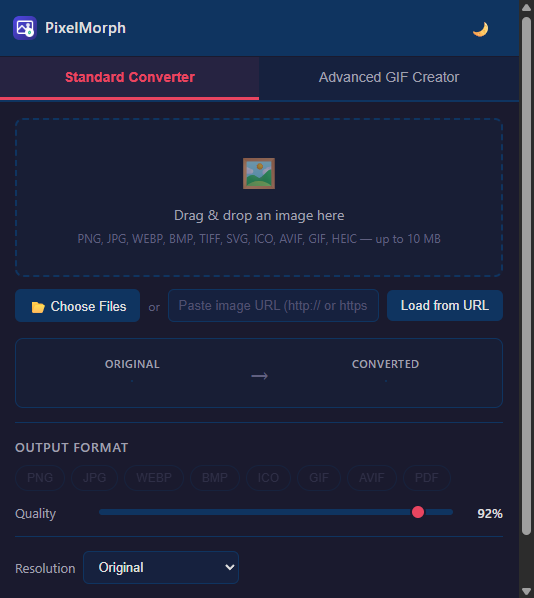
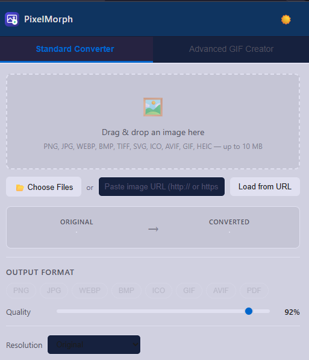
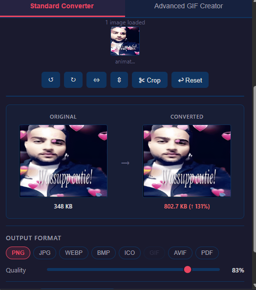
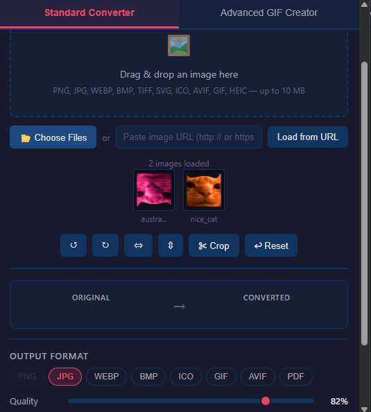
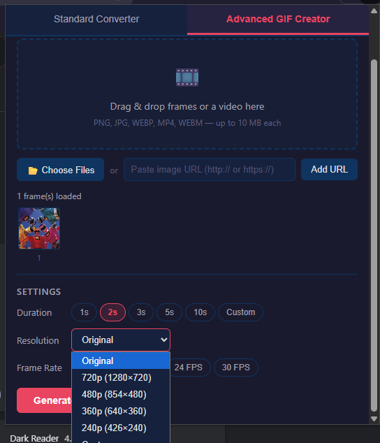
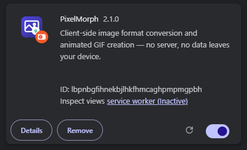

# 🌟 PixelMorph (Image Type Converter & GIF Studio)

<p align="center">
  
</p>

<p align="center">
  
</p>

A powerful, privacy-first Google Chrome extension that lets you convert image formats, edit pictures, and create animated GIFs entirely on your device. **Zero servers, zero uploads, 100% private.**

---

## ✨ Features

- **⚡ Instant Format Conversion:** Convert between PNG, JPG, WEBP, AVIF, HEIC, HEIF, ICO, PDF, and GIF instantly.
- **📦 Batch Processing:** Convert multiple images at once and download them instantly bundled as a ZIP archive.
- **🎨 Built-in Image Editor:** Easily crop, rotate (90° left/right), and flip (horizontal/vertical) images before converting.
- **⚖️ Before & After Comparison:** Real-time visual comparison showing original vs converted file sizes and visual quality differences.
- **🎚️ Output Quality Slider:** Fine-tune compression levels for lossy formats (JPEG, WEBP, AVIF) with a precise slider.
- **🖱️ Context Menu Integration:** Right-click any image or video on the web and select "Convert Image" or "Extract to GIF" to instantly load it into the extension.
- **🎬 Animated GIF Creator:** Generate custom animated GIFs from static images or directly extract frames from videos (MP4, WEBM). Customize frame rates and durations (0.1s to 300s).
- **🌓 Light & Dark Themes:** Global theme toggle that saves your preference.
- **🔒 100% Client-Side:** All processing happens securely in your browser using HTML5 Canvas and Web Workers. No data ever leaves your machine.

---

### 🌓 Light & Dark Themes

<p align="center">
  
  &nbsp;&nbsp;
  
</p>

---

### 🎨 Image Editor & Before/After Comparison

<p align="center">
  
</p>

---

### 📦 Batch Conversion

<p align="center">
  
</p>

---

### 🎬 Advanced GIF Creator

<p align="center">
  
</p>

---

## 🎥 Video Tutorial

> *Tutorial by a community member — not affiliated with this project.*

<p align="center">
  <a href="https://www.youtube.com/watch?v=NH5CPm9pyts" target="_blank">
    
  </a>
</p>

---

## 🛠️ Installation

Since this extension processes everything locally, you can easily install it as an "Unpacked Extension" in Chrome:

1. Clone or download this repository to your local machine:
   ```bash
   git clone https://github.com/propagandafromuganda/Image-type-converter.git
   ```
2. Open Google Chrome and navigate to `chrome://extensions/`.
3. Enable **"Developer mode"** by toggling the switch in the top right corner.
4. Click the **"Load unpacked"** button in the top left.
5. Select the downloaded `Image-type-converter` folder.
6. The extension is now installed! Pin it to your toolbar for easy access.

<p align="center">
  
</p>

---

## 🧪 Testing

This project features a comprehensive suite of 145 property-based, integration, and unit tests using **Vitest** and **fast-check** to ensure robust performance across all edge cases.

To run the tests locally:

1. Make sure you have [Node.js](https://nodejs.org/) installed.
2. Install the dependencies:
   ```bash
   npm install
   ```
3. Run the test suite:
   ```bash
   npm test
   ```

## 🏗️ Tech Stack

- **Core:** Vanilla JavaScript (ES Modules), HTML5, CSS3
- **GIF Encoding:** [gif.js](https://github.com/jnordberg/gif.js) (Web Worker based)
- **ZIP Encoding:** Zero-dependency vanilla JS implementation
- **Testing:** [Vitest](https://vitest.dev/), jsdom, fast-check, jest-canvas-mock

## 📜 License

This project is open-source and available under the MIT License.
